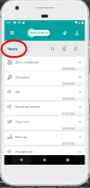
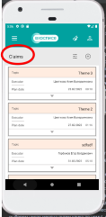

# *_План по проверке и автоматизации приложения «Мобильный хоспис»_* 

|

## _Приложение состоит и включает в себя_:

### Страницы и разделы имеющие следующий функционал:

### _Создание, редактирование, удаление, просмотр и поиск новостей.   Создание, редактирование, поиск, просмотр претензий, а так же создание и редактирование коментариев к ним._

## Cтраница загрузки приложения включает в себя: 

>  
>
> 

>
> * _Меняющуюся каждый раз при загрузке приложения_ **фоновую картинку**
> * _Крутящееся колесико_ **индикатора загрузки**
> * _Меняющуюся каждый раз при загрузке_ **цитату**
>  
>  
>  
>  
>  
>  
>  
>  
>  
>  
>  
>  

|

## Cтраницa "Authorization" включает в себя:

  

> 

>
> ### Форму с полями для заполнения и дальнейшей авторизации пользователя и входа в систему
> 
> * Поле _для ввода логина_ (**login**)
> * Поле _для ввода пароля_ (**password**)
> * Кнопка **"SIGN IN"**
>  
>  
>  
>  
>  
>  
>  
>  
>  
>  

|

## Cтраницa **_"Main"_** (Главная страница в которую пользователь попадает после авторизации) включает в себя:

 

> 

>
> ###  страница **_"Main"_** включает в себя:
>
> * _Верхняя часть придожения содержит_ **три кнопки** _которые доступны на каждой из страниц_ **"Claims", "News", "Main"** _а так же раздела_ **"Control panel**":
>
> * Кнопока (**_три полоски_**) _для раскрытия выпадающего списка со страницами, осуществления выбора и перехода на страницу_ (**_"About", "Claims", "News", "Main"_**)
> * Кнопка (**_иконка в виде человека_**) _для выхода пользователя из профиля_. 
> * Кнопка (**_иконка в виде бабочки_**) _для перехода пользователя на страницу с тематическими цитатами_.
>  
>  
>  
>  
>  
>  
>  

|

### Два выпадающих окна "News" и "Claims" которые включают в себя:

 

> 

>
> * "**_News_**" - _новостную сводку хосписа в виде ленты, из последних трех созданных новостей (отдельных блоков), которую есть возможность развернуть, свернуть_.
> * **Новостные блоки** _которые так же есть возможность развернуть, свернуть, для подробного просмотра_.
> * **Кнопку** _в виде названия_ "**_all news_**" _для перехода на страницу_ "**_News_**", _просмотра полной ленты новостных блоков_, а так же для доступа к функционалу страницы.
>
> * "**_Claims_**" - _информацию о претензиях в виде ленты из отдельных блоков, в которые есть возможность зайти при клике на них_, а так же доступа к функционалу в нем.
> * **Кнопку** _в виде названия_ "**_all Claims_**" _для перехода на страницу "Claims" просмотра полной ленты блоков с претензиями_, а так же для доступа к функционалу страницы.
> * **Кнопку** _для перехода в раздел создания претензии (_"Creating Claims"_) в виде_ "+"  
>  
>  
>  
>  
>  
>  

|

## Страница "**_News_**" включает в себя:

 

> 

>
> * **Ленту из блоков новостей** _с категориями, отсортированых по дате от самой ранней к самой поздней, блоки можно развернуть и свернуть для просмотра описания_.
> * **Кнопка** (**_иконка в виде двух стрелок указывающих вверх и вниз_**), _при нажатии лента новостей меняется, вверху списка появляются созданные раньше всех новости, внизу созданные позже всех_. 
> * **Кнопка** (**_три полоски с кружками_**), _при нажатии осуществляет переход в _"Filter news"_ для осуществления поиска новости, новостей с использованием фильтров содержащих поля:_   **категории и даты** _с использованием всплывающего окна с_ **календарем** _(управление происходит двумя кнопками "<", ">" смены месяца, года, а так же выбором числа месяца путем клика по нему) для поиска_ 
> * **Кнопка** _иконка в виде_ **блокнота с карандашом**) _при нажатии осуществляет переход в _"Control panel"_ для доспупа к функциям управления новостями_. 
>  

|

## Раздел **_"Filter news"_** включает в себя:

 

> 

>
> ### Форма с полями для использования фильтров:
> * **Поле** _для выбора и установки_ **Категории**
> * **Поле** _для выбора и установки_ **даты** _с использованием всплывающего окна с календарем (управление происходит двумя_ **кнопками "<", ">"** _смены_ **месяца, года**, _а так же выбором_ **числа** _месяца путем клика по нему) для поиска_
> * Кнопкa **FILTER** - _для активации поиска_ 
> * Кнопкa **CANCEL** - _для отмены поиска_
>  
>  
>  
>  
>  

|

## "Control panel" - включает в себя:

> 

>
> * **Кнопка** (**иконка в виде двух стрелок указывающих вверх и вниз**) _для смены сортировки новостей по датам (вверху списка появляются созданные раньше всех новости, внизу созданные позже всех)_.
> * **Кнопка** (**три полоски с кружками**) _для перехода в **"Filter news"** _и осуществления поиска новости, новостей с использованием фильтров при заполнении формы содержащей поля_: **категории, даты, статус**.
> * **Кнопка** (**_+_**)  _для перехода в раздел создания новости_ **"Creating News"**, _содержащий форму для заполнения с полями:   
     выбора_ **категории**, _ввода_ **названия**, _установки_ **даты публикации** _с использованием всплывающего окна с календарем.   Управление календарем происходит двумя кнопками "<", ">" для смены_ **месяца, года**, _а так же выбором_ **числа месяца** _путем клика по нему)_, 
 поле для установки **времени** _с использованием всплывающего окна с часами имеющими два типа, стрелочный: управление осуществляется переводом часовой и минутной стрелок и цифровой установка времени осуществляется при помощи ввода чисел в поля **"hour, minute"**,) и поле для **описания**, а так же работающую в постоянном режиме кнопку **"active"** для отображения статуса_ 
> * _Так же в_ **управление новостями** _есть возможность развернуть, свернуть каждый отдельно взятый новостной блок нажатием на него или стрелку вниз, возможность отредактировать отдельно взятую новость (нажать на кнопку **"блокнот с карандашем"** и перейти в раздел **"Editing News"**) или удалить новость (нажатием на кнопку с иконкой_ **"мусорный бачек**"). 
>  
>

|

## Раздел **_"Creating News"_** включает в себя:

> 

>
> ### Форма с полями для заполнения:
> * **Поле** _для выбора и установки_ **Категории**
> * **Поле** _для ввода_ **Названия**
> * **Поле** _для выбора и установки_ **Даты** _с использованием всплывающего окна с_ **календарем** _управление происходит двумя_ **кнопками "<", ">"** _смены_ **месяца, года**, _а так же выбором_ **числа** _месяца путем клика по нему) для поиска_
> * **Поле** _для выбора и установки_ **Времени** _с использованием всплывающего окна с_ **часами** _имеющего два типа, стрелочный: управление осуществляется переводом_ **часовой и минутной** _стрелок и_ **цифровой** _установка времени осуществляется при помощи ввода чисел в поля_ **"hour, minute"**)
> * **Поле** _для ввода_ **Описания**
> * Кнопкa **SAVE** - _для сохранения новости_
> * Кнопкa **CANCEL** - _для сохранения новости_
>  
>  

## Страница "**_Claims_**" включает в себя: 

> 

>
> * **Информацию о всех претензиях** _в виде ленты из отдельных блоков (каждый блок содержит информацию о названии, исполнителе, этапы работы с претензией в виде статусов_ **"Open",  "In progress",  "executed", "canceled"**, дате, времени и коментариях), отсортированых по дате от самой ранней к самой поздней, в которые есть возможность зайти при клике на них, отредактировать жалобу (в разделе **"Editing Claims"** со статусом **"Open"**), взять в работу (со статусом **"Open"**), отбросить или взять в работу (со статусом **"In Progress"**) или добавить коментарий, коментарии (в претензии со всеми статусами)._
> * **Кнопка** (**три полоски с кружками**), _при нажатии осуществляет переход в_ **"Filtering"** _для поиска претензии, с использованием фильтров содержащих статусы_.
> * **Кнопка** "+" _для осуществления перехода в раздел_ **"Creating Claims"** _для создания претензии, содержащий форму с полями_:  
     _поле для ввода_ **названия**,   _поле с выбором из списка_ **исполнителя**,   _поле для установки_ **даты** _с использованием всплывающего окна с календарем. Управление происходит двумя кнопками "<", ">" для смены_ **месяца**, **года**, _а так же выбором_ **числа месяца** _путем клика по нему),  поле для установки_ **времени** _с использованием всплывающего окна с часами имеющими два типа,_ **стрелочный**: _управление осуществляется переводом часовой и минутной стрелок и_ **цифровой** _установка времени осуществляется при помощи ввода чисел в поля_ **"hour**, **minute**")  _поле для ввода описания_.
>  
>  

|

## Раздел **_"Filtering"_** включает в себя:

|

> 

>
> ### Oкно с чек-боксами статусов
> * Кнопка **"ОК"** _для активации поиска_
> * Кнопка "**CANCEL"** _для отмены поиска_
>  
>  
>  
>  
>  
>  
>  
>  
>  
>  
>
 
|

## Раздел "**_Creating Claims_**" включает в себя:

> 

>
> Форма с полями для заполнения:
> * **Поле** _для ввода_ **Названия**
> * **Поле** _для выбора и установки_ **Исполнителя**
> * **Поле** _для выбора и установки_ **Даты** с использованием всплывающего окна с **календарем** _управление происходит двумя кнопками "<", ">" смены месяца, года, а так же выбором числа месяца путем клика по нему) для поиска_
> * **Поле** _для выбора и установки_ **Времени**  _с использованием всплывающего окна с_ **часами** _имеющего два типа, стрелочный: управление осуществляется переводом_ **часовой и минутной** _стрелок и_ **цифровой** _установка времени осуществляется при помощи ввода чисел в поля_ **"hour, minute"**)
> * **Поле** _для ввода_ **Описания**
> * Кнопкa **SAVE** - _для сохранения новости_
> * Кнопкa **CANCEL** - _для отмены сохранения новости_
>   
>  
>  

|

## Страница "**_About_**" включает в себя:

> 

>
> * **Кнопка назад "<"** _для осуществления перехода к предыдущей странице или разделу_.
> * _Информацию о_ **версии** _приложения_
> * _Две ссылки с информацией_ (**Privacy Policy, Terms of use**)
> * _Название_ **производителя** _и_ **год выпуска**       
>  
>  
>  
>  
>  
>  
>  

|

# чек-лист:

 ### 1. Проверка экрана загрузки приложения:
>   - Проверка индекатора загрузки, цитата, картинка.
 ### 2. Проверка экрана авторизации
>  - Проверка элементов:
>   - Проверка **названия** экрана _Authorization_
>   - Проверка полей **login, password**
>   - Проверка кнопки **SING IN**
>   - Проверка появления всплывающих, предупреждающих сообщений 
 ### 3. Проверка экрана "_Main_"
>    - Проверка панели управления перехода к экранам:
>     - Проверка элементов:
>   - Кнопка **action menu**
>   - Кнопка с иконкой **бабочки**
>   - Кнопка с иконкой **человека**
>   - Проверка отображения элементов в лентах:
>        - Блоки новостей
>        - Блоки претензий
>   - Проверка элементов:
>        - **Сворачивание/разворачивание** ленты с блоками новостей (кнопка с иконкой "_галочка_")
>        - **Сворачивание/разворачивание** ленты с блоками претензий (кнопка с иконкой "_галочка_")
>        - **Сворачивание/разворачивание** отдельного новостного блока (кнопка с иконкой "_галочка_")
>        - **Вход/выход** из отдельной претензии (клик на претензию)
>        - **Создание претензии** (кнопка с иконкой "+")
 ### 4. Проверка экрана "_News_"
>   - Проверка **названия** экрана:
>   - Проверка элементов:
>      - Название экрана _News_
>   - Проверка новостной ленты:
>     - **Сворачивание/разворачивание** отдельной новости (кнопка с иконкой "_галочка_")
>   - Проверка элементов:
>     - Порядок отображения новостей, смена порядока отображения новостей (кнопка с иконкой "_стрелки вверх/вниз_")
>     - Переход на страницу поика новостей _Filter news_" (кнопка с иконкой "три полоски с кружками")
>     - Переход на экран "_Control Panel_" (кнопка с иконкой "блокнот с карандашом")
>   - отображение информации в каждой взятой отдельно новости:
>   - Проверка элементов:
>     - Название 
>     - Дата публикации
 ### 5. Проверка экрана "_Control Panel_"
>   - Проверка **названия** экрана:
>   - Проверка элементов:
>      - Название экрана _Control Panel_
>   - Проверка новостной ленты:
>     - **Сворачивание/разворачивание** отдельной новости (кнопка с иконкой "_галочка"_)
>   - Проверка элементов:
>     - **Порядок** отображения новостей, смена порядока отображения новостей (кнопка с иконкой "_стрелки вверх/вниз_")
>     - **Поиск** новостей с помощью фильтрации новостей "_Filter news_" (кнопка с иконкой "_три полоски с кружками_")
>     - Переход в раздел создания новости "_Creating News_" (кнопка с иконкой "_плюс в кружке_")
>     - Переход на страницу редактирования новости _Editing News_ (кнопка с иконкой "_клокнот с карандашем_") 
>     - **Удаление** новости (кнопка с иконкой "_мусорный бачок_")
>   - отображение информации в каждой взятой отдельно новости:
>   - Проверка элементов:
>     - Название
>     - Дата публикации
>     - Дата создания
>     - Автор
>     - Статус новости
 ### 6. Проверка экрана "_Claims_"
>   - Проверка **названия** экрана:
>   - Проверка элементов:
>      - Название экрана _Claims_ 
>   - Проверка ленты с претензиями:
>     - **Вход/выход** из отдельной претензии
>   - Проверка элементов:
>     - Открытие окна c экраном поика _"Filtering"_ (кнопка с иконкой "_три полоски с кружками_")
>     - Переход в раздел создания претензии "_Creating Claims_" (кнопка с иконкой "_плюс в кружке_")
>     - Переход в претензию (клик на претензию)
>   - отображение информации в каждой взятой отдельно новости:
>   - Проверка элементов:
>     - Название
>     - Дата публикации
>     - Дата создания
>     - Исполнитель
>     - Время создания
 ### 7. Проверка экрана "_About_"
>   - Проверка отображения элементов:
>        - Версия приложения
>        - Права пользования
>        - Права конфиденциальности
>        - Название вирмы-изготовителя
>   - Проверка элементов:
>          - Открытие ссылки "Права пользования"
>          - Открытие ссылки "Права конфиденциальности"
 ### 8. Проверка экрана _"Тематические цитаты"_
>   - Проверка **названия** экрана:
>   - Проверка элементов:
>      - Название экрана _Love is all_
>   - Проверка отображения элементов 
>     - **Сворачивание/разворачивание** отдельной цитаты (кнопка с иконкой "_галочка"_)
 ### 9. Проверка экрана "_Filter news_"
>   - Проверка **названия** экрана:
>   - Проверка элементов:
>      - Название экрана _Filter news_
>   - Проверка формы с полями:
>     - открытие выпадающего списка с категориями
>     - открытие календаря, выбор, установка даты
>     - Подтверждение/отмена поиска новостей
>   - Проверка элементов:
>      - поле _"Category"_
>      - поля _"DD.MM.YYYY"_
>      - (кнопки "_FILTER", "CANCEL_") 
### 10. Проверка экрана расширенного поиска "_Filter news_"
>   - Проверка **названия** экрана:
>   - Проверка элементов:
>      - Название экрана _Filter news_
>   - Проверка формы с полями:
>     - открытие выпадающего списка с категориями
>     - открытие календаря, выбор, установка даты
>     - Подтверждение/отмена поиска новостей
>   - Проверка элементов:
>      - поле _"Category"_
>      - поля _"DD.MM.YYYY"_
>      - (кнопки "_FILTER", "CANCEL_")
>      - Чек-боксы _"Active", "Not active"_
### 11. Проверка экрана "_Creating News_"
>   - Проверка **названия** экрана:
>   - Проверка элементов:
>      - Название экрана _Creating news_
>   - Проверка формы с полями:
>     - Открытие выпадающего списка с категориями
>     - Заполнение полей (_Title, Time, Description, Publication date_)
>     - Открытие календаря, выбор, установка даты
>     - Открытие часов, выбор установка времени
>     - Переключение статуса
>     - Подтверждение/отмена поиска (кнопки _"SAVE", "CANCEL"_)
>      - Появление предупреждающих сообщений
>   - Проверка элементов:
>     - поле _"Category"_
>     - Поле "_Title_"
>     - поле _"Publication date"_
>     - Поле "_Time_"
>     - Поле "_Description_"
>     - (кнопки "_SAVE_", "CANCEL_")
 ### 12. Проверка экрана "_Editing News_"
>   - Проверка **названия** экрана:
>   - Проверка элементов:
>      - Название экрана _Editing news_
>   - Проверка формы с полями:
>     - Открытие выпадающего списка с категориями
>     - Заполнение полей (_Title, Time, Description, Publication date_)
>     - Открытие календаря, выбор, установка даты
>     - Открытие часов, выбор установка времени
>     - Переключение статуса 
>     - Подтверждение/отмена поиска (кнопки _"SAVE", "CANCEL"_)
>      - Появление предупреждающих сообщений
>   - Проверка элементов:
>     - поле _"Category"_
>     - Поле "_Title_"
>     - поле _"Publication date"_
>     - Поле "_Time_"
>     - Поле "_Description_"
>     - (кнопки "_SAVE_", "CANCEL_")
 ### 13. Проверка экрана "_Editing Claims_"
>   - Проверка **названия** экрана:
>   - Проверка элементов:
>      - Название экрана _Editing Claims_
>    - Проверка формы с полями:
>      - Открытие выпадающего списка с исполнителями
>      - Заполнение полей (_Title, Time, Description, Publication date_)
>      - Открытие календаря, выбор, установка даты
>      - Открытие часов, выбор установка времени
>      - Подтверждение/отмена поиска (кнопки _"SAVE", "CANCEL"_)
>      - Появление предупреждающих сообщений
>    - Проверка элементов:
>      - Поле "_Title_"
>      - поле _"Executor"_
>      - Поле "_Date_"
>      - поле _"Time"_
>      - Поле "_Description_"
>      - (кнопки _"SAVE", "CANCEL"_)
### 14. Проверка экрана "_Creating Claims_"
>   - Проверка **названия** экрана:
>   - Проверка элементов:
>      - Название экрана _Creating Claims_
>    - Проверка формы с полями:
>      - Открытие выпадающего списка с исполнителями
>      - Заполнение полей (_Title, Time, Description, Publication date_)
>      - Открытие календаря, выбор, установка даты
>      - Открытие часов, выбор установка времени
>      - Подтверждение/отмена поиска (кнопки _"SAVE", "CANCEL"_)
>      - Появление предупреждающих сообщений
>    - Проверка элементов:
>      - Поле "_Title_"
>      - поле _"Executor"_
>      - Поле "_Date_"
>      - поле _"Time"_
>      - Поле "_Description_"
>      - (кнопки _"SAVE", "CANCEL"_)
### 15. Проверка экрана "_Календарь_"
>   - Проверка верхней части календаря
>   - Отображение года, дня недели, месяца, числа
>   - Проверка элементов:
>     - год
>     - день недели, месяц, число
>   - Проверка перехода к выбору года
>   - Проверка элементов:
>     - год (нажатие на год)
>   - Проверка экрана с выбором года
>   - Проверка элементов
>     - Год, день недели, месяца, числа, список годов
>     - Кнопки _"ok", "cancel"_
>   - Проверка средней части календаря
>     - Отображение месяца, года
>     - чисел месяца
>     - Выбор числа месяца (нажатие на число)
>     - Переход к следующему/предыдущему месяцу (кнопка с иконкой галочки)
>   - Проверка нижней части календаря
>   - (кнопки _"ok", "cancel"_)
### 16. Проверка экрана "_Часы_"
>   - Проверка верхней части часов
>   - Проверка элементов
>     - Отображение времени
>   - Проверка средней части часов
>   - Отображение часов стрелочного типа
>   - Проверка элементов
>     - Циферблат
>   - Проверка нижней части часов
>   - Проверка перехода к цифровым часам
>     - Кнопка с иконкой клавиатуры
>   - Проверка отмены/подтверждения установки времени
>   - Проверка элементов:
>     - Кнопки _"ok", "cancel"_
>   - Проверка цифровых часов 
>   - Проверка названия
>   - Проверка элементов:
>     - Проверка названия _Set time_
>   - Проверка установки времени 
>   - Проверка элементов:
>     - поле _hour, minute_
>   - Проверка возвращения к стрелочному типу часов
>   - Проверка элементов:
>     - Кнопка с инонкой циферблата со стрелками
## Уровни тестирования:

* _Модульное тестирование_ - проверка отдельно модулей **_"Authorization", "About", "Claims", "News", "Main", "Creating Claims", "Creating News", "Control panel", "Filter news", "Editing News", "Editing Claims", "Claims", " "Filtering", "Часы", "Календарь"_**

|

* _Интеграционное тестирование_ - проверка взаимодействия между компонентами (Переход со страницы **_"Authorization"_** на главную страницу, с главной страницы **_"Main"_** на страницу,
  **_"About", "Claims", "News", "Main"_**, переход из "страниц" в разделы "**_Creating Claims","Creating News","Control panel", "Filter news", "Editing News", "Editing Claims","Claims", "Filtering"_**, создание, удаление, редактирование, поиск новостей и претензий, создание и редактирование коментариев)

## Виды тестирования:

* Функциональное тестирование
* Тестирование пользовательского интерфейса

# 4) Автоматизируем приложение

## Перечень автоматизируемых сценариев:

- _Тестирование функциональности экрана загрузки_
- _Тестирование функциональности входа (экран авторизации), выхода из профиля_
- _Тестирование функционала переходов на страницы и в разделы_
- _Тестирование функционала развертывания, свертывания блоков и выпадающих списков_
- _Тестирование функционала при заполнении форм в разделах "**Creating News", "Creating Claims", "Editing News", "Comment", "Editing Claims**"_
- _Тестирование  функционала создания, удаления, редактирования, отмены действий создания, удаления, редактирования, новостей, коментариев и претензий_
- _Тестирование функционала поиска новостей и жалоб_
- _Тестирование функционала часов_
- _Тестирование функцианала календаря_

## Перечень используемых инструментов для автоматизации:

| **_Инструмент_**           | **_Описание_**                                                    |
|----------------------------|-------------------------------------------------------------------|
| **_java_**                 | язык програмирования для написания тестов                         |
| **_Android studio_**       | программа, для работы с кодом                                     |
| **_Record espresso test_** | программа для автоматизации                                       |
| **_Layout inspector_**     | программа для поиска идентификаторов                              |
| **_Gradle_**               | система автоматической сборки внутри android studio               |
| **_JUnit 4_**              | библиотека для тестирования                                       |
| **_Allure_**               | используем для наглядного изображения прохождения тестов и ошибок |
| **_Git_**                  | система контроля версий                                           |
| **_GitHub_**               | для хранения тестов                                               |
| **_GitHub Action_**        | CI для непрерывной интеграции                                     |

## Перечень и описание возможных рисков при автоматизации:

Возможна смена кода, придется править код;  
Смена формы заполнения после какого-либо времени;  
Невозможность написания в форме некоторых букв ;  
Неоправданная стоимость автоматизации;  
Поиск id и прочих локаторов

## Перечень необходимых специалистов для автоматизации:

Специалист по автоматизированному тестированию;

## Интервальная оценка с учётом рисков (в часах):

Необходимое время на тестирование составляет 80 часов, с учетом рисков - 92 часа. 

